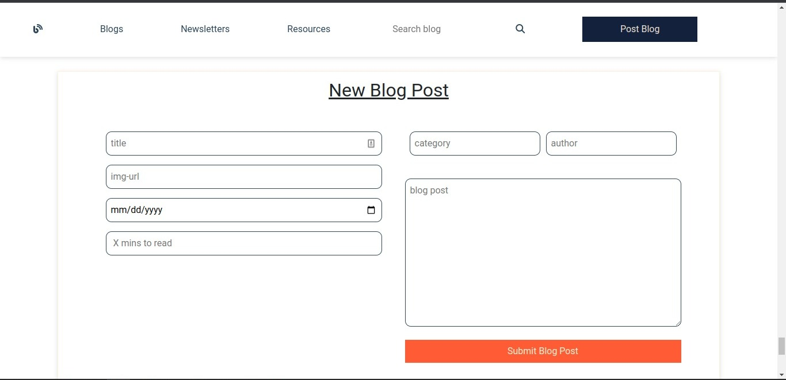

# BLOGIFY 


`Blogify`,users are able to find interesting blogs about various topics.Users are able to like the blog of their choice, search for the existing blogs with their titles , filter blogs with categories, blogs added latest and top blogs which have more likes than others.Blogify also allows the users to post a new blog which can be read by other users.


## TECHNOLOGIES USED.  
---
- HTML
- CSS/Bootstrap.
- Javascript/ React.


## SETUP REQUIREMENTS.  
 ---
- Copy the github repository url
- Clone to your computer
- Open terminal and navigate to the directory of the project you just cloned to your computer
- Run the following command to install all the dependencies
 ```
npm install
```


## SCREENSHOTS OF THE APPLICATION.

- Home Section.
  

- Categories Section. 
  
  

- Filter New Blogs Section. 
  
  

- Filter Top Blogs Section. 
  
  

- Blogcard Section. 
  
   

- Postblog Section. 
  
   

- Footer Section. 
  
  


## AUTHOR  
---

- [Gathoni Wanjira](https://github.com/Gathoni-Wanjira)

## COPYRIGHT.  
--- 

Released under the MIT License. See the [LICENSE](https://github.com/Gathoni-Wanjira/Blogify) file.

